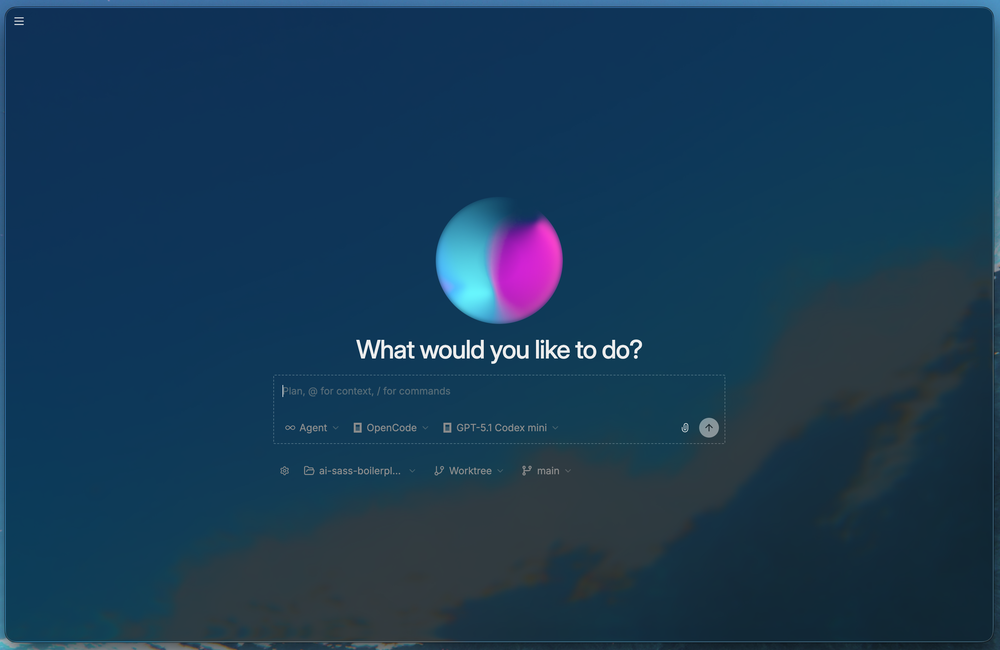
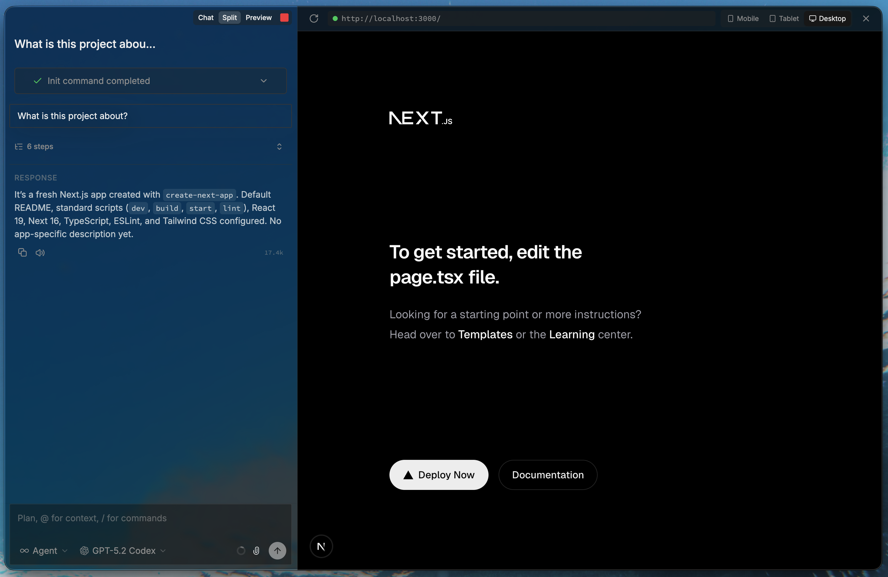
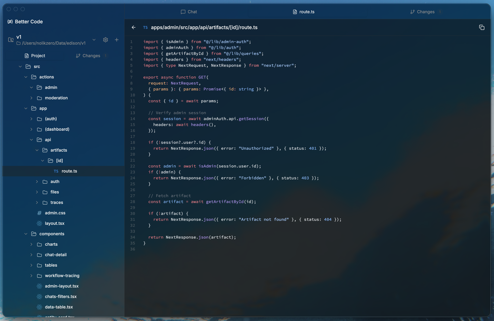
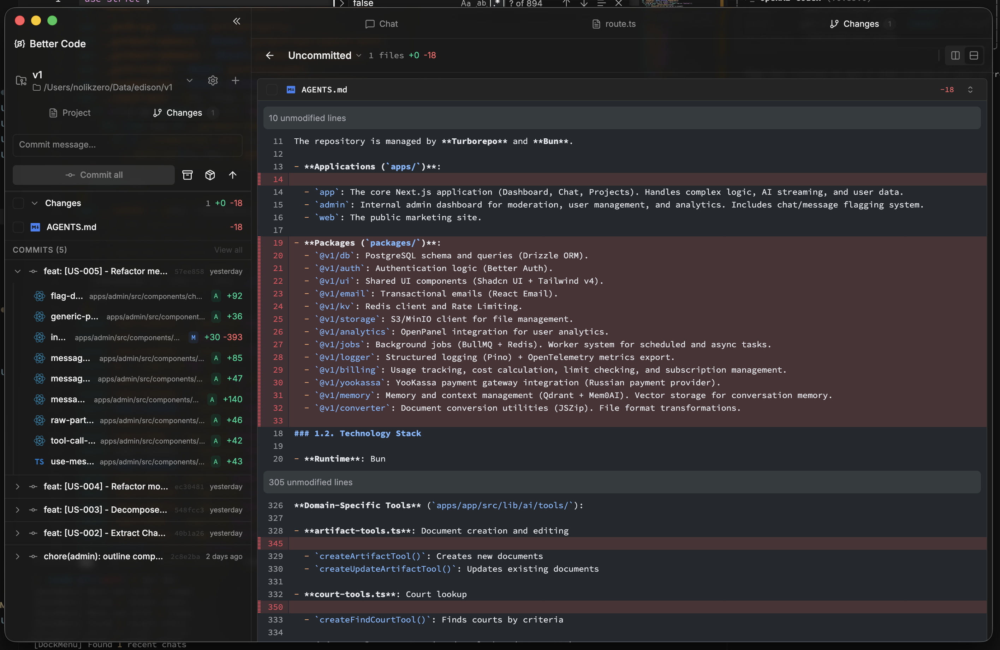

# BetterCode

**UI for parallel work with AI agents** -- a local-first Electron desktop app for AI-powered code assistance with multi-provider support.

[]()
[]()
[]()
[]()
[](LICENSE)

[Download](#installation) | [Documentation](CLAUDE.md) | [Contributing](CONTRIBUTING.md)

---


*Start screen.*

## Screenshots


*Browser integration.*


*View project files.*


*Viewing diff changes.*

## Features

### AI-Powered Coding

- **Multi-Provider Support** -- Use Claude, OpenAI Codex, or OpenCode as your AI backend
- **Plan and Agent Modes** -- Switch between read-only analysis (Plan) and full code execution permissions (Agent)
- **Ralph Mode** -- Autonomous coding sessions with minimal user input
- **Session Resume** -- Continue conversations across app restarts with full context preservation

### Development Tools

- **Integrated Terminal** -- Full xterm-based terminal with multiple panes and session persistence
- **Real-time Tool Execution** -- Watch bash commands, file edits, and web searches execute live
- **Git Worktree Isolation** -- Each chat session runs in its own isolated Git worktree for safe experimentation
- **Change Tracking** -- Visual diffs, file change tracking, and PR management

### Project Management

- **Project Linking** -- Link local folders with automatic Git remote detection for GitHub, GitLab, and Bitbucket
- **VSCode Theme Support** -- Import and apply your favorite VSCode themes with builtin theme options
- **Cross-Platform** -- Native builds for macOS, Linux, and Windows (experimental)

### Privacy

- **Zero Analytics** -- No telemetry, no data collection, fully local-first

## Installation

### Download Release

Download the latest release for your platform from the [Releases](https://github.com/Nolikzero/better-code/releases) page.

| Platform | Formats |
|----------|---------|
| macOS (Apple Silicon) | DMG, ZIP |
| Linux (x64, arm64) | AppImage, DEB, RPM |
| Windows (x64) | NSIS installer |

### Build from Source

**Prerequisites:**
- [Bun](https://bun.sh/) package manager
- Node.js 18+ (for native module compilation)
- **macOS**: Xcode Command Line Tools (`xcode-select --install`)
- **Linux**: Build essentials (`build-essential`, `python3`)
- **Windows**: Visual Studio Build Tools

```bash
git clone https://github.com/Nolikzero/better-code.git
cd better-code
bun install
bun run build
bun run package:mac      # or package:win, package:linux
```

### Development Setup

```bash
git clone https://github.com/Nolikzero/better-code.git
cd better-code
bun install
bun run dev              # Start with hot reload
```

## Quick Start

1. **Launch the app** -- Open BetterCode after installation
2. **Complete onboarding** -- Sign in with your Claude account or configure your preferred AI provider
3. **Add a project** -- Click "Add Project" and select a local folder (Git repos are auto-detected)
4. **Start chatting** -- Choose Plan or Agent mode and begin your coding session

## Architecture

```
┌─────────────────────────────────────────────────────────────┐
│                    Electron Application                     │
├─────────────────┬─────────────────┬─────────────────────────┤
│  Main Process   │     Preload     │   Renderer Process      │
│  (Node.js)      │  (IPC Bridge)   │      (React 19)         │
├─────────────────┼─────────────────┼─────────────────────────┤
│ • tRPC Routers  │ • Context       │ • Tailwind CSS 4        │
│   (15 routers)  │   Isolation     │ • Radix UI Components   │
│ • SQLite +      │ • desktopApi    │ • Jotai + Zustand       │
│   Drizzle ORM   │   Exposure      │ • React Query           │
│ • Git Ops +     │                 │ • xterm Terminal        │
│   Worktrees     │                 │ • Shiki Highlighting    │
│ • AI Providers  │                 │                         │
│   (3 providers) │                 │                         │
│ • Terminal PTY  │                 │                         │
└─────────────────┴─────────────────┴─────────────────────────┘
```

For detailed architecture documentation, see [CLAUDE.md](CLAUDE.md).

## AI Providers

BetterCode supports multiple AI backends through a unified provider interface:

| Provider | SDK | Description |
|----------|-----|-------------|
| Claude | `@anthropic-ai/claude-agent-sdk` | Anthropic Claude with full tool use |
| Codex | `@openai/codex-sdk` | OpenAI Codex for code generation |
| OpenCode | `@opencode-ai/sdk` | OpenCode AI provider |

Providers can be switched per-chat and support both Plan mode (read-only) and Agent mode (full execution permissions).

## Tech Stack

| Layer | Technologies | Version |
|-------|--------------|---------|
| Desktop | Electron, electron-vite, electron-builder | 40.0.0 |
| Frontend | React, TypeScript, Tailwind CSS | 19.2.3, 5.9.3, 4.1.18 |
| Components | Radix UI, Lucide icons, Motion | -- |
| State | Jotai, Zustand, React Query | 2.16.2, 5.0.10, 5.x |
| Backend | tRPC, Drizzle ORM, better-sqlite3 | 11.8.1, 0.45.1, 12.x |
| AI | Claude Agent SDK, Codex SDK, OpenCode SDK, Vercel AI SDK | -- |
| Terminal | xterm, node-pty | 6.0.0, 1.1.0 |
| Code | Shiki (syntax highlighting) | 3.21.0 |
| Git | simple-git | 3.30.0 |
| Linting | Biome | 2.3.11 |
| Package Manager | Bun | -- |

## Development

### Commands

| Command | Description |
|---------|-------------|
| `bun run dev` | Start development with hot reload |
| `bun run build` | Production build |
| `bun run package:mac` | Package for macOS (DMG + ZIP) |
| `bun run package:win` | Package for Windows (NSIS) |
| `bun run package:linux` | Package for Linux (AppImage, DEB, RPM) |
| `bun run db:generate` | Generate database migrations |
| `bun run db:push` | Push schema directly (dev only) |
| `bun run db:studio` | Open Drizzle Studio for database inspection |
| `bun run lint` | Run Biome linter |
| `bun run format` | Format code with Biome |
| `bun run typecheck` | TypeScript type checking |

### Database

BetterCode uses SQLite with Drizzle ORM. The database is stored at `{userData}/data/agents.db` and migrations run automatically on startup.

## Documentation

- [Architecture Guide](CLAUDE.md) -- Detailed codebase structure, patterns, and development reference
- [Contributing Guide](CONTRIBUTING.md) -- How to contribute to BetterCode

## Contributing

Contributions are welcome. See [CONTRIBUTING.md](CONTRIBUTING.md) for guidelines.

```bash
# Fork and clone the repo
git clone https://github.com/YOUR_USERNAME/better-code.git
cd better-code

# Install dependencies
bun install

# Create a branch for your feature
git checkout -b feature/your-feature

# Make changes, then submit a PR
```

## License

Apache License 2.0 -- see [LICENSE](LICENSE) for details.
