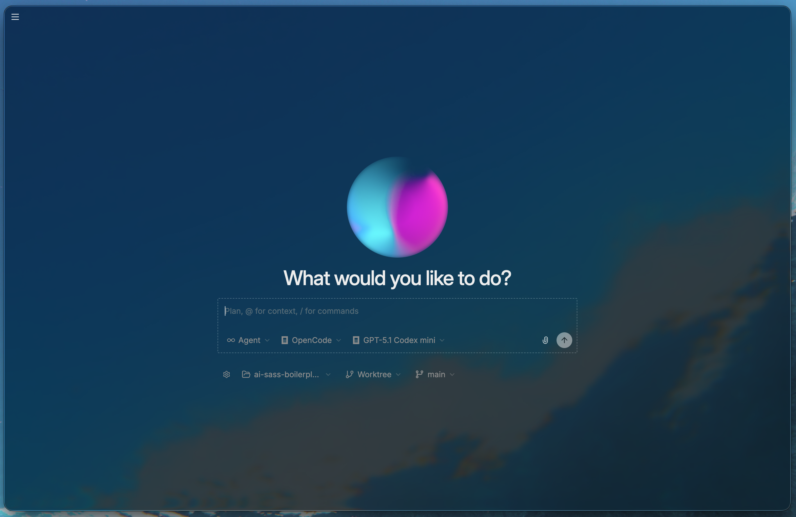
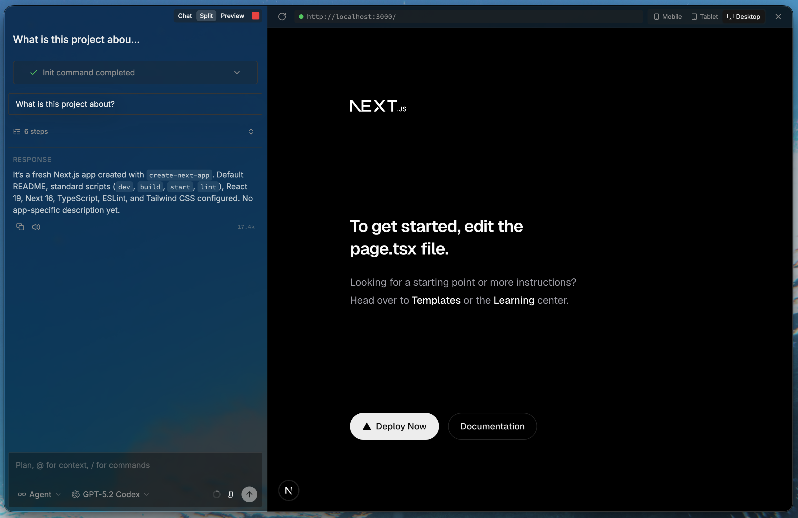
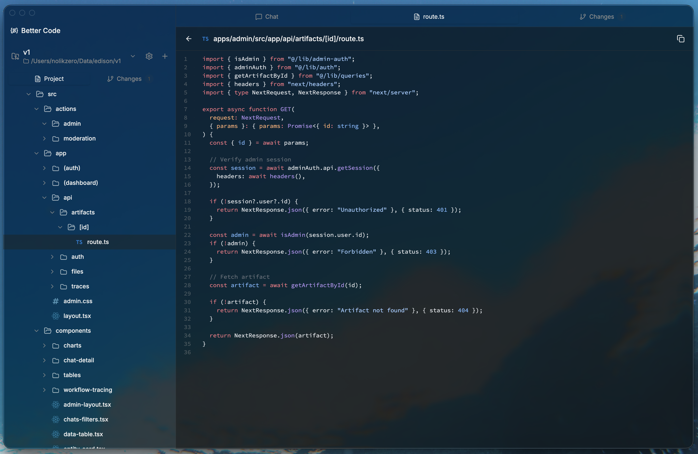
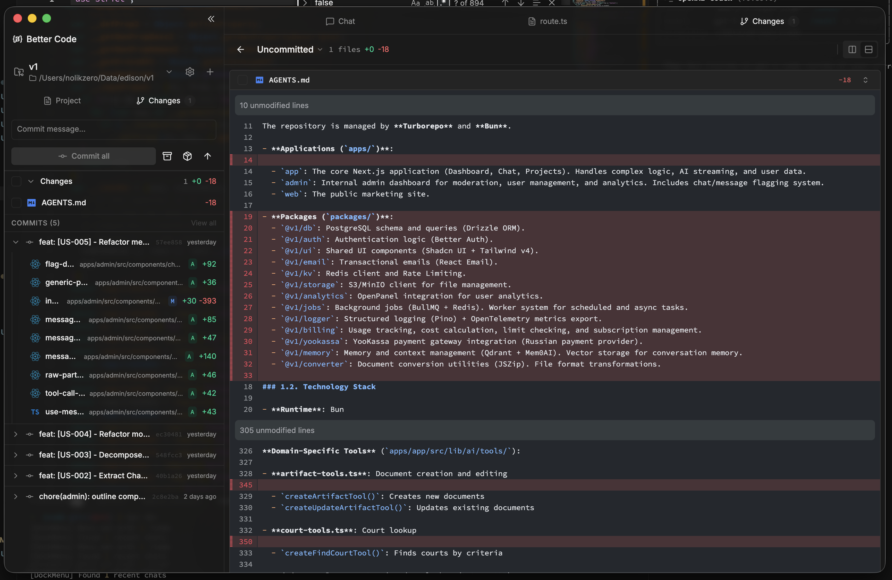

# SamBetterCode

**面向并行 AI 编程智能体的本地优先桌面工作台。**

SamBetterCode 基于 BetterCode 上游 `main` 分支提交 `d8b0248f70b2` 升级迭代，提供完整的简体中文界面，并保留与上游数据目录、协议和工作树结构的兼容性。应用采用 Electron、React 与 TypeScript 构建，可在同一桌面界面中管理项目、对话、终端、Git 变更以及 Claude、OpenAI Codex、OpenCode 等 AI 提供商。

[]()
[]()
[]()
[]()
[](LICENSE)

- [核心能力](#核心能力)
- [环境要求](#环境要求)
- [安装与开发](#安装与开发)
- [AI-提供商登录](#ai-提供商登录)
- [构建与打包](#构建与打包)
- [数据与隐私](#数据与隐私)
- [兼容性标识](#兼容性标识)
- [参与贡献](#参与贡献)

---



## 界面预览

| 本地预览 | 项目文件 |
| --- | --- |
|  |  |



> 图片继承自上游版本，实际界面文案已完成简体中文本地化。

## 核心能力

### 并行 AI 编程

- **多提供商支持**：统一接入 Claude、OpenAI Codex 和 OpenCode，并可按对话选择提供商与模型。
- **计划与智能体模式**：在只读分析和允许执行代码修改的工作模式之间切换。
- **Ralph 自动执行**：从 PRD 生成到任务推进的自主编程流程。
- **多对话与子对话**：并行处理不同任务，保留上下文并支持恢复历史会话。
- **实时工具状态**：查看命令、文件编辑、搜索、待办事项和其他工具的执行进度。

### 开发工作台

- **集成终端**：基于 xterm 和 node-pty 的多窗格终端，支持会话恢复。
- **Git 工作树隔离**：为对话创建独立工作树，降低并行修改之间的冲突风险。
- **变更与差异审查**：集中查看文件状态、行级差异、提交、暂存、推送和 PR 流程。
- **项目文件浏览**：项目索引、快速搜索、文件查看和外部编辑器打开能力。
- **本地服务预览**：在应用内预览开发服务器，并使用常见设备尺寸检查页面。
- **主题与快捷键**：支持内置主题、VS Code 主题和可配置快捷键。

### 桌面体验

- 面向 macOS、Linux 和 Windows 的 Electron 桌面应用。
- 托盘、Dock、系统通知、应用菜单和自动更新入口。
- 简体中文覆盖 onboarding、主界面、设置、Git、终端、Provider、Ralph、错误与空状态。
- 为中文界面配置 CJK 字体回退、换行和布局兼容处理。

## 环境要求

基础环境：

- [Bun](https://bun.sh/)：依赖安装和脚本执行。
- Node.js 18 或更高版本：原生模块编译及部分工具链需要。
- Python 3：`electron-rebuild` 和原生依赖编译可能需要。
- Git：项目、分支和工作树功能需要。

平台构建工具：

- **macOS**：Xcode Command Line Tools，可运行 `xcode-select --install` 安装。
- **Linux**：常见构建工具链，例如 `build-essential`、`python3`；打包格式可能需要额外系统依赖。
- **Windows**：Visual Studio Build Tools，建议安装“使用 C++ 的桌面开发”工作负载。

若项目使用 Git LFS，还应安装 `git-lfs` 并运行：

```bash
git lfs install
```

## 安装与开发

### 安装依赖

在项目根目录运行：

```bash
bun install
```

安装过程会执行 `electron-rebuild`，为当前 Electron 版本重新编译原生模块。首次安装耗时通常较长，请确保 Python 和平台编译工具可用。

### 启动开发环境

```bash
bun run dev
```

该命令启动 Electron 开发模式和热更新。开发时请同时关注启动终端中的主进程日志，以及应用内的错误和提供商状态。

### 常用检查

```bash
bun run lint        # Biome 静态检查
bun run typecheck   # TypeScript 类型检查
bun run check       # Biome lint + format 检查
bun run build       # 生产构建
```

不要对整个仓库执行无关的批量格式化。提交前只修复本次改动涉及的文件，并确保 Biome 的导入排序和未使用代码检查通过。

## AI 提供商登录

SamBetterCode 不会替代各提供商的官方身份验证流程。请先安装对应 CLI 或在 OpenCode 中配置提供商凭据。

### Claude Code

安装 Claude Code CLI：

```bash
curl -fsSL https://claude.ai/install.sh | sh
```

登录：

```bash
claude login
```

完成浏览器身份验证后，重新打开 SamBetterCode 的提供商设置以刷新状态。

### OpenAI Codex

安装 Codex CLI：

```bash
npm install -g @openai/codex
```

可选择以下任一方式：

```bash
codex login
```

或设置环境变量：

```bash
OPENAI_API_KEY=你的密钥
```

应用同时兼容 Codex CLI 的本地 OAuth 状态和 API 密钥，不应将 Codex 身份验证简化为仅支持 API 密钥。

### OpenCode

启动或连接 OpenCode 后，在 OpenCode 中配置所需提供商的 API 密钥。SamBetterCode 会读取 OpenCode 返回的连接状态和模型列表；如果没有已连接的提供商，应用会提示先完成 OpenCode 配置。

## 构建与打包

### 仅构建

```bash
bun run build
```

### 当前平台目录包

```bash
bun run package:dir
```

### 平台安装包

```bash
bun run package:mac
bun run package:win
bun run package:linux
```

通用打包入口：

```bash
bun run package
```

macOS 签名和公证可使用 `.env.example` 中的可选变量：

- `APPLE_ID`
- `APPLE_APP_SPECIFIC_PASSWORD`
- `APPLE_TEAM_ID`
- `APPLE_IDENTITY`

本地开发无需配置这些变量；未签名构建可能触发操作系统安全提示。

## 数据库与架构

SamBetterCode 采用 Electron 多进程架构：

```text
Electron 主进程
├─ 应用生命周期、窗口、菜单、托盘和系统能力
├─ tRPC 路由、SQLite / Drizzle、Git、终端和 AI 提供商
└─ 通过受限 IPC 与 preload 通信

Preload
└─ 在 context isolation 下暴露经过白名单限制的 desktopApi

React 渲染进程
├─ React 19、TypeScript、Tailwind CSS、Radix UI
├─ Jotai、Zustand、React Query
└─ 对话、设置、项目、终端、差异和 Ralph 界面
```

数据库使用 SQLite 和 Drizzle ORM。开发环境中的迁移位于 `drizzle/`，应用启动时自动执行迁移。数据库默认存放在：

```text
{userData}/data/agents.db
```

数据库相关命令：

```bash
bun run db:generate
bun run db:push       # 仅用于开发；持久变更应审查并提交迁移
bun run db:studio
```

## 数据与隐私

- 应用采用本地优先设计，项目索引、会话数据、设置和数据库保存在本机用户数据目录。
- 项目文件和 Git 操作在本机执行；终端由本机 PTY 进程提供。
- 应用未内置产品分析或遥测采集流程。
- 发送给 AI 提供商的提示词、上下文和工具结果受所选提供商及其服务条款约束，可能通过网络传输。
- API 密钥、CLI 登录状态和 OpenCode 凭据应继续由对应提供商或 CLI 的既有机制管理；不要将密钥提交到仓库。
- 调试日志可能包含路径、命令和错误信息。分享日志前请检查并移除敏感内容。

## 兼容性标识

为避免破坏既有安装、深层链接、更新缓存和工作树数据，本次品牌升级仅修改用户可见的名称与中文文案，以下内部标识继续保留：

| 标识 | 保留原因 |
| --- | --- |
| npm 包名 `bettercode-desktop` | 依赖、构建和历史包兼容 |
| Electron `appId`：`app.bettercode.desktop` | 已安装应用、系统集成和升级兼容 |
| 协议：`bettercode`、`bettercode-dev` | 深层链接兼容 |
| 工作树目录：`.bettercode/worktrees` | 既有项目和对话数据兼容 |
| 更新缓存：`bettercode-updater` | 自动更新缓存兼容 |
| Windows AppUserModelId | 通知、快捷方式和安装升级兼容 |

这些标识不代表界面品牌仍为 BetterCode。用户可见产品名称统一为 **SamBetterCode**。

## 上游与版本说明

- 当前 SamBetterCode 升级基线：BetterCode `main` / `d8b0248f70b2`。
- 上游项目：[Nolikzero/better-code](https://github.com/Nolikzero/better-code)。
- 历史版本记录保留在 [CHANGELOG.md](CHANGELOG.md) 中；SamBetterCode 的本地化升级说明位于文件顶部。
- `LICENSE` 和 `NOTICE` 保持上游法律文本原样。

## 参与贡献

欢迎提交缺陷修复、中文文案改进、跨平台兼容性修复和功能增强。请先阅读 [CONTRIBUTING.md](CONTRIBUTING.md)，并在提交前至少运行：

```bash
bun run lint
bun run typecheck
bun run build
```

涉及界面的改动还应实际启动 Electron，检查明暗主题、窄窗口、中文换行与裁切、终端、差异视图以及 `drag` / `no-drag` 区域。

## 许可证

本项目沿用 Apache License 2.0。详情请参阅 [LICENSE](LICENSE) 和 [NOTICE](NOTICE)。
